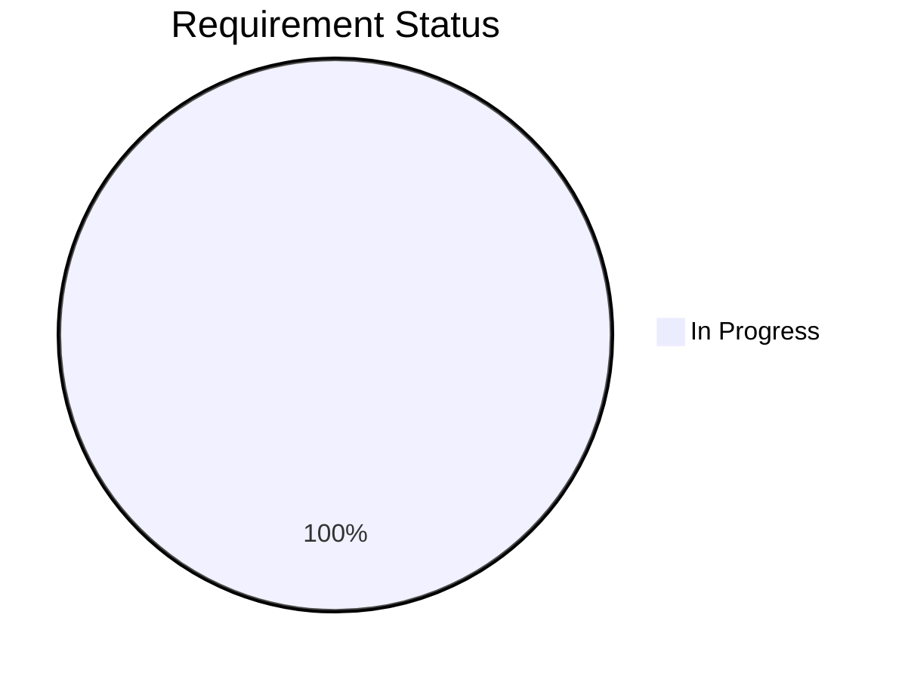

# Project Blueprint

Last updated: 2026-06-10

## Status Distribution



## Progress Bar

```
001 cli-custom-model-path     [████████████████████] 100%
```

## Roadmap

| ID | Name | Phase | Status | Dependencies | Priority | Notes |
|---|---|---|---|---|---|---|
| 001 | cli-custom-model-path | 07 Done | ✅ done | - | P1 | Implemented --model-dir/-M option |

**Phase labels:** `01 Init` · `02 Prerequisite` · `03 Algorithm` · `04 Plan` · `05 Tasks` · `06 Start-and-resume` · `07 Execution` · `Round Review` · `Phase 01* (Next Round)` · `07 Done`

**Status labels:** `⏳ pending` · `▶ in-progress` · `⏸ blocked` · `✅ done`
